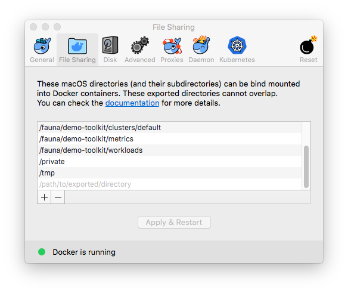

# Exercise 4a - Running Envoy Manually

This Envoy exercise is copied from [Front Proxy](https://www.envoyproxy.io/docs/envoy/latest/start/sandboxes/front_proxy.html)

### Background on docker

If you have problems with docker the following commands are helpful:

View all running docker images and find the container id:
`docker ps -a`

Force remove a running docker image:
`docker rm -f #CONTAINER_ID`

### Docker File Sharing on Mac

On a mac you need to share the directoy to `envoy-front-proxy`.  To mount the `envoy-front-proxy` directory inside of the docker container you need to first setup docker file sharing. Under docker preferences go to the File Sharing dialog and add the envoy-conf directory:




### Docker Compose Overview


###  Running the Sandbox

The following documentation runs through the setup of an envoy cluster organized as is described in the image above.

#### Step 1: Install Docker

Ensure that you have a recent versions of docker, docker-compose and docker-machine installed.

A simple way to achieve this is via the Docker Toolbox.

#### Step 2: Start all of our containers

  ```sh
  $ pwd
  envoy/examples/front-proxy
  $ docker-compose up --build -d
  $ docker-compose ps
          Name                       Command               State      Ports
  -------------------------------------------------------------------------------------------------------------
  example_service1_1      /bin/sh -c /usr/local/bin/ ... Up       80/tcp
  example_service2_1      /bin/sh -c /usr/local/bin/ ... Up       80/tcp
  example_front-envoy_1   /bin/sh -c /usr/local/bin/ ... Up       0.0.0.0:8000->80/tcp, 0.0.0.0:8001->8001/tcp
  ```

####  Step 3: Test Envoy’s routing capabilities

You can now send a request to both services via the front-envoy.

For service1:

  ```sh
  $ curl -v localhost:8000/service/1
  ```

For service2:

  ```sh
  curl -v localhost:8000/service/2
  ```

#### Step 4: Test Envoy’s load balancing capabilities

Now let’s scale up our service1 nodes to demonstrate the clustering abilities of envoy.:

  ```sh
  $ docker-compose scale service1=3
  Creating and starting example_service1_2 ... done
  Creating and starting example_service1_3 ... done
  ```

Now if we send a request to service1 multiple times, the front envoy will load balance the requests by doing a round robin of the three service1 machines:

  ```sh
  curl -v localhost:8000/service/1
  ```

#### Step 7: enter containers and curl services

In addition of using curl from your host machine, you can also enter the containers themselves and curl from inside them. To enter a container you can use docker-compose exec <container_name> /bin/bash. For example we can enter the front-envoy container, and curl for services locally:

  ```sh
  $ docker-compose exec front-envoy /bin/bash
  root@81288499f9d7:/# curl localhost:80/service/1
  Hello from behind Envoy (service 1)! hostname: 85ac151715c6 resolvedhostname: 172.19.0.3
  root@81288499f9d7:/# curl localhost:80/service/1
  Hello from behind Envoy (service 1)! hostname: 20da22cfc955 resolvedhostname: 172.19.0.5
  root@81288499f9d7:/# curl localhost:80/service/1
  Hello from behind Envoy (service 1)! hostname: f26027f1ce28 resolvedhostname: 172.19.0.6
  root@81288499f9d7:/# curl localhost:80/service/2
  Hello from behind Envoy (service 2)! hostname: 92f4a3737bbc resolvedhostname: 172.19.0.2
  ```

#### Step 8: enter containers and curl admin

When envoy runs it also attaches an admin to your desired port. In the example configs the admin is bound to port 8001. We can curl it to gain useful information. For example you can curl /server_info to get information about the envoy version you are running. Additionally you can curl /stats to get statistics. For example inside frontenvoy we can get:

$ docker-compose exec front-envoy /bin/bash
root@e654c2c83277:/# curl localhost:8001/server_info
envoy 10e00b/RELEASE live 142 142 0
root@e654c2c83277:/# curl localhost:8001/stats
cluster.service1.external.upstream_rq_200: 7
...
cluster.service1.membership_change: 2
cluster.service1.membership_total: 3
...
cluster.service1.upstream_cx_http2_total: 3
...
cluster.service1.upstream_rq_total: 7
...
cluster.service2.external.upstream_rq_200: 2
...
cluster.service2.membership_change: 1
cluster.service2.membership_total: 1
...
cluster.service2.upstream_cx_http2_total: 1
...
cluster.service2.upstream_rq_total: 2
...
Notice that we can get the number of members of upstream clusters, number of requests fulfilled by them, information about http ingress, and a plethora of other useful stats.


curl the Envoy proxy on port `15001`:

```sh
curl -s http://localhost:15001/headers
```

Notice that Envoy added a X-Request-Id

Curl the Envoy admin stats and then zero in on the retry count:

```sh
curl -s http://localhost:15000/stats
curl -s http://localhost:15000/stats | grep retry
```

In the simple json the retry policy for 5xx is set to:

"retry_policy": {
  "retry_on": "5xx",
  "num_retries": 3
}

If you trigger a 500 you can see the retry count go up:

```sh
curl -s http://localhost:15001/status/500
curl -s http://localhost:15001/status/500
curl -s http://localhost:15001/status/500
curl -s http://localhost:15001/status/500
curl -s http://localhost:15001/status/500
curl -s http://localhost:15000/stats | grep retry
```

#### [Continue to Exercise 5 - Installing Istio](../exercise-5/README.md)
